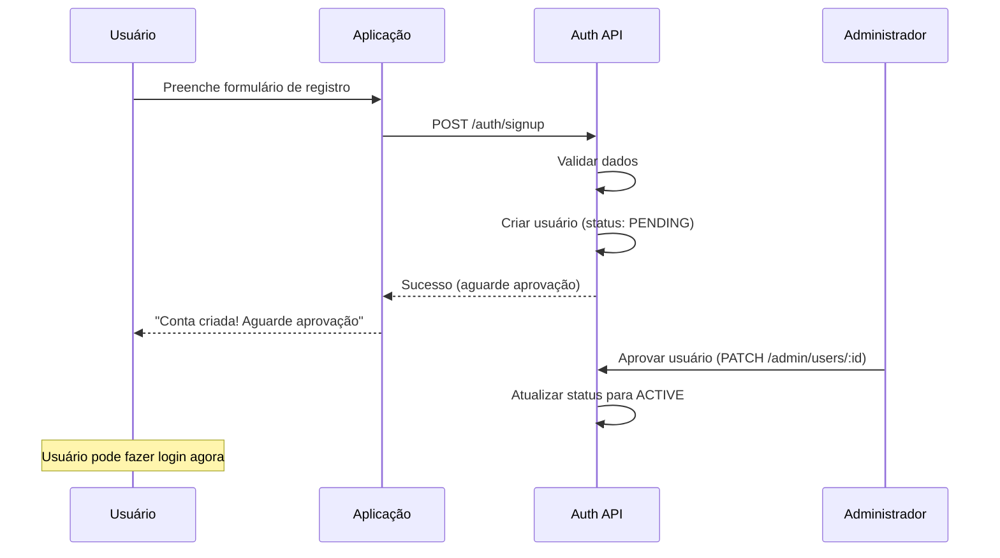
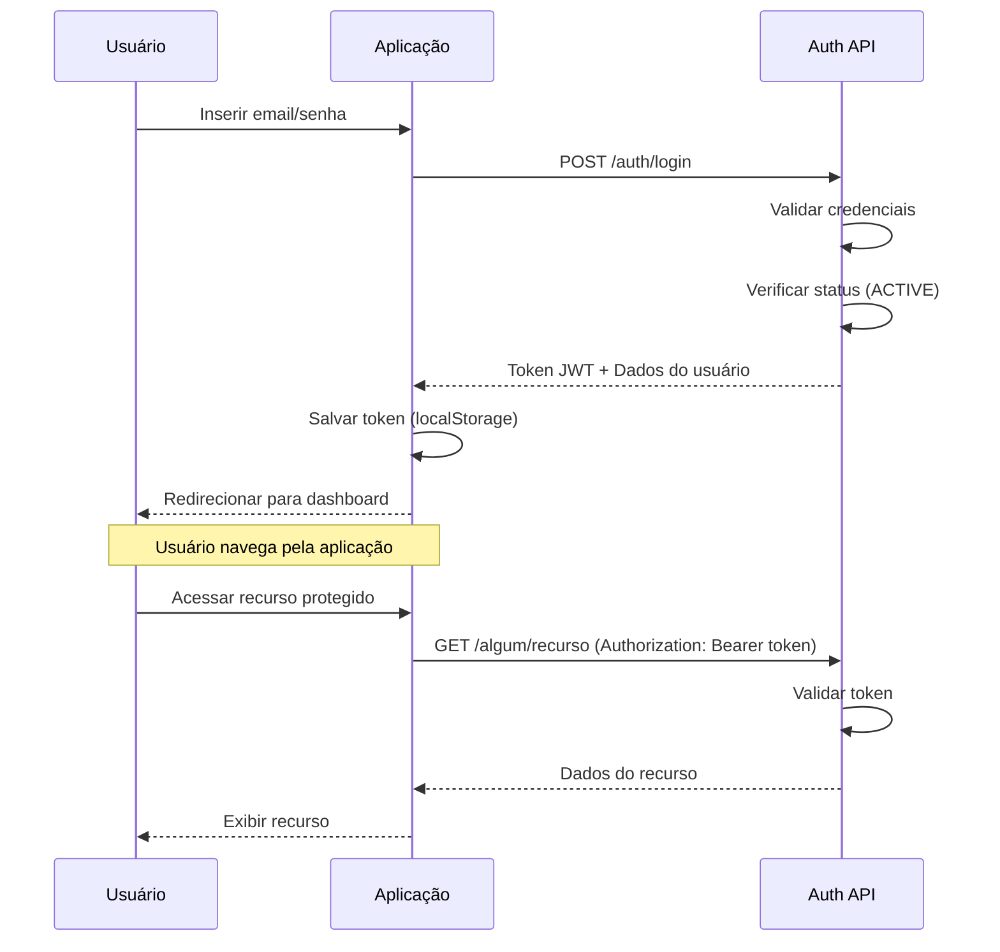
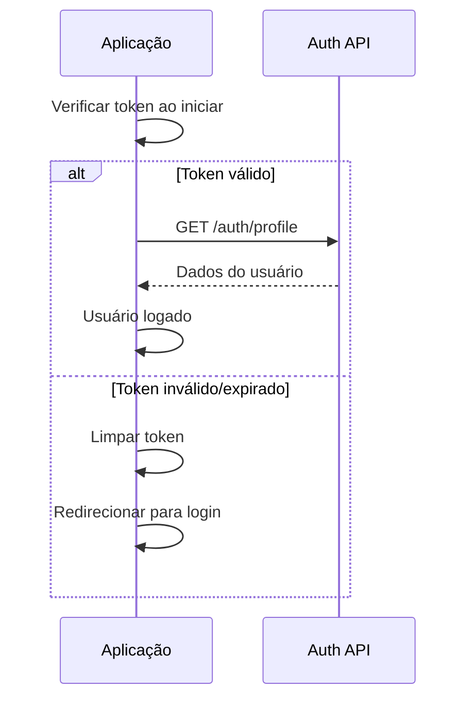

# 🔌 Guia de Integração - Sistema de Autenticação TGOO

## 📖 Introdução

Bem-vindo ao guia de integração do sistema de autenticação centralizado da TGOO. Este documento orientará você no processo de conectar sua aplicação ao nosso backend de autenticação.

### O que você vai aprender:
- ✅ Como configurar sua aplicação para usar o sistema de autenticação
- ✅ Fluxos completos de Login, Registro e Gerenciamento de Sessão
- ✅ Exemplos de código em JavaScript/TypeScript, Python e outras linguagens
- ✅ Tratamento de erros e boas práticas
- ✅ Segurança e proteção de rotas

---

## 🎯 Visão Geral

### Arquitetura

O sistema de autenticação TGOO é **centralizado** e suporta **múltiplas plataformas**:

```
┌─────────────────────────────────────┐
│   auth.tgoo.eu (Backend Central)    │
│                                     │
│  ┌───────────────────────────────┐ │
│  │      MySQL Database           │ │
│  │  - platforms                  │ │
│  │  - users (isolados por plat.) │ │
│  └───────────────────────────────┘ │
└─────────────────────────────────────┘
              ▲
              │ API REST (JSON)
              │
    ┌─────────┼─────────┐
    │         │         │
┌───▼───┐ ┌──▼───┐ ┌───▼───┐
│ App 1 │ │ App 2│ │ App 3 │
│DressMe│ │Proj 2│ │Proj 3 │
└───────┘ └──────┘ └───────┘
```

### Características Principais

| Característica | Descrição |
|---------------|-----------|
| 🏢 **Multi-Plataforma** | Cada aplicação é uma "plataforma" com usuários isolados |
| 🔐 **JWT Tokens** | Autenticação baseada em JSON Web Tokens |
| 👥 **3 Níveis de Acesso** | USER, ADMIN, SUPER_ADMIN |
| 📧 **Email Único por Plataforma** | Mesmo email pode existir em plataformas diferentes |
| ✅ **Aprovação Manual** | Novos usuários começam com status PENDING |

---

## 🚀 Início Rápido

### 1. Configuração Básica

#### Variáveis de Ambiente

Crie um arquivo `.env` na raiz da sua aplicação:

```env
# URL do backend de autenticação
VITE_API_URL=https://auth.tgoo.eu/api
# ou para desenvolvimento:
# VITE_API_URL=http://localhost:3001/api

# Código da sua plataforma (fornecido pelo SUPER_ADMIN)
VITE_PLATFORM_CODE=dressme
```

#### Obter Código da Plataforma

Antes de integrar, você precisa de um código de plataforma. Entre em contato com um SUPER_ADMIN ou consulte a lista de plataformas:

```bash
curl https://auth.tgoo.eu/api/auth/platforms
```

---

## 📝 Exemplos de Integração

### 🌐 JavaScript / TypeScript (Frontend)

#### Instalação de Dependências

```bash
npm install axios
# ou
npm install @tanstack/react-query axios
```

#### Criar Serviço de API

```typescript
// src/services/auth.service.ts
import axios from 'axios';

const API_URL = import.meta.env.VITE_API_URL || 'http://localhost:3001/api';
const PLATFORM_CODE = import.meta.env.VITE_PLATFORM_CODE || 'dressme';

// Cliente Axios configurado
const api = axios.create({
  baseURL: API_URL,
  headers: {
    'Content-Type': 'application/json',
  },
});

// Interceptor para adicionar token em todas as requisições
api.interceptors.request.use((config) => {
  const token = localStorage.getItem('authToken');
  if (token) {
    config.headers.Authorization = `Bearer ${token}`;
  }
  return config;
});

// Tipos TypeScript
export interface LoginRequest {
  email: string;
  password: string;
}

export interface SignupRequest {
  email: string;
  password: string;
  fullName?: string;
}

export interface User {
  id: number;
  email: string;
  fullName: string | null;
  role: 'USER' | 'ADMIN' | 'SUPER_ADMIN';
  status: 'PENDING' | 'ACTIVE' | 'BLOCKED';
  platform: {
    id: number;
    code: string;
    name: string;
  };
}

export interface AuthResponse {
  token: string;
  user: User;
}

// Funções do serviço
export const authService = {
  // 1. Login
  async login(data: LoginRequest): Promise<AuthResponse> {
    const response = await api.post('/auth/login', {
      ...data,
      platform: PLATFORM_CODE,
    });
    
    // Salvar token
    localStorage.setItem('authToken', response.data.token);
    
    return response.data;
  },

  // 2. Registro
  async signup(data: SignupRequest): Promise<{ message: string; user: User }> {
    const response = await api.post('/auth/signup', {
      ...data,
      platform: PLATFORM_CODE,
    });
    return response.data;
  },

  // 3. Obter Perfil
  async getProfile(): Promise<User> {
    const response = await api.get('/auth/profile');
    return response.data;
  },

  // 4. Logout
  logout() {
    localStorage.removeItem('authToken');
  },

  // 5. Verificar se está autenticado
  isAuthenticated(): boolean {
    return !!localStorage.getItem('authToken');
  },

  // 6. Obter token
  getToken(): string | null {
    return localStorage.getItem('authToken');
  },

  // 7. Alterar senha
  async changePassword(oldPassword: string, newPassword: string): Promise<void> {
    await api.post('/password/change', {
      oldPassword,
      newPassword,
    });
  },
};

export default authService;
```

#### Exemplo com React + Context API

```typescript
// src/contexts/AuthContext.tsx
import React, { createContext, useContext, useState, useEffect } from 'react';
import { authService, User } from '../services/auth.service';

interface AuthContextData {
  user: User | null;
  loading: boolean;
  login: (email: string, password: string) => Promise<void>;
  signup: (email: string, password: string, fullName?: string) => Promise<void>;
  logout: () => void;
  isAuthenticated: boolean;
}

const AuthContext = createContext<AuthContextData>({} as AuthContextData);

export const AuthProvider: React.FC<{ children: React.ReactNode }> = ({ children }) => {
  const [user, setUser] = useState<User | null>(null);
  const [loading, setLoading] = useState(true);

  // Carregar usuário ao iniciar
  useEffect(() => {
    async function loadUser() {
      try {
        if (authService.isAuthenticated()) {
          const userData = await authService.getProfile();
          setUser(userData);
        }
      } catch (error) {
        console.error('Erro ao carregar usuário:', error);
        authService.logout();
      } finally {
        setLoading(false);
      }
    }
    loadUser();
  }, []);

  async function login(email: string, password: string) {
    const { user: userData } = await authService.login({ email, password });
    setUser(userData);
  }

  async function signup(email: string, password: string, fullName?: string) {
    await authService.signup({ email, password, fullName });
    // Nota: após signup, usuário precisa ser aprovado
  }

  function logout() {
    authService.logout();
    setUser(null);
  }

  return (
    <AuthContext.Provider
      value={{
        user,
        loading,
        login,
        signup,
        logout,
        isAuthenticated: !!user,
      }}
    >
      {children}
    </AuthContext.Provider>
  );
};

export const useAuth = () => useContext(AuthContext);
```

#### Componentes de Login e Registro

```typescript
// src/pages/Login.tsx
import React, { useState } from 'react';
import { useAuth } from '../contexts/AuthContext';
import { useNavigate } from 'react-router-dom';

export const Login: React.FC = () => {
  const [email, setEmail] = useState('');
  const [password, setPassword] = useState('');
  const [error, setError] = useState('');
  const [loading, setLoading] = useState(false);
  
  const { login } = useAuth();
  const navigate = useNavigate();

  async function handleSubmit(e: React.FormEvent) {
    e.preventDefault();
    setError('');
    setLoading(true);

    try {
      await login(email, password);
      navigate('/dashboard');
    } catch (err: any) {
      setError(err.response?.data?.error || 'Erro ao fazer login');
    } finally {
      setLoading(false);
    }
  }

  return (
    <div className="login-container">
      <h1>Login</h1>
      
      {error && <div className="error-message">{error}</div>}
      
      <form onSubmit={handleSubmit}>
        <div>
          <label>Email:</label>
          <input
            type="email"
            value={email}
            onChange={(e) => setEmail(e.target.value)}
            required
          />
        </div>
        
        <div>
          <label>Senha:</label>
          <input
            type="password"
            value={password}
            onChange={(e) => setPassword(e.target.value)}
            required
            minLength={6}
          />
        </div>
        
        <button type="submit" disabled={loading}>
          {loading ? 'Entrando...' : 'Entrar'}
        </button>
      </form>
      
      <p>
        Não tem conta? <a href="/signup">Criar conta</a>
      </p>
    </div>
  );
};
```

```typescript
// src/pages/Signup.tsx
import React, { useState } from 'react';
import { useAuth } from '../contexts/AuthContext';
import { useNavigate } from 'react-router-dom';

export const Signup: React.FC = () => {
  const [email, setEmail] = useState('');
  const [password, setPassword] = useState('');
  const [fullName, setFullName] = useState('');
  const [error, setError] = useState('');
  const [success, setSuccess] = useState('');
  const [loading, setLoading] = useState(false);
  
  const { signup } = useAuth();
  const navigate = useNavigate();

  async function handleSubmit(e: React.FormEvent) {
    e.preventDefault();
    setError('');
    setSuccess('');
    setLoading(true);

    try {
      await signup(email, password, fullName);
      setSuccess('Conta criada! Aguarde aprovação do administrador.');
      
      // Redirecionar após 3 segundos
      setTimeout(() => navigate('/login'), 3000);
    } catch (err: any) {
      setError(err.response?.data?.error || 'Erro ao criar conta');
    } finally {
      setLoading(false);
    }
  }

  return (
    <div className="signup-container">
      <h1>Criar Conta</h1>
      
      {error && <div className="error-message">{error}</div>}
      {success && <div className="success-message">{success}</div>}
      
      <form onSubmit={handleSubmit}>
        <div>
          <label>Nome Completo:</label>
          <input
            type="text"
            value={fullName}
            onChange={(e) => setFullName(e.target.value)}
          />
        </div>
        
        <div>
          <label>Email:</label>
          <input
            type="email"
            value={email}
            onChange={(e) => setEmail(e.target.value)}
            required
          />
        </div>
        
        <div>
          <label>Senha (mín. 6 caracteres):</label>
          <input
            type="password"
            value={password}
            onChange={(e) => setPassword(e.target.value)}
            required
            minLength={6}
          />
        </div>
        
        <button type="submit" disabled={loading}>
          {loading ? 'Criando...' : 'Criar Conta'}
        </button>
      </form>
      
      <p>
        Já tem conta? <a href="/login">Fazer login</a>
      </p>
    </div>
  );
};
```

#### Rota Protegida

```typescript
// src/components/ProtectedRoute.tsx
import React from 'react';
import { Navigate } from 'react-router-dom';
import { useAuth } from '../contexts/AuthContext';

interface ProtectedRouteProps {
  children: React.ReactNode;
  requireRole?: 'USER' | 'ADMIN' | 'SUPER_ADMIN';
}

export const ProtectedRoute: React.FC<ProtectedRouteProps> = ({ 
  children, 
  requireRole 
}) => {
  const { user, loading } = useAuth();

  if (loading) {
    return <div>Carregando...</div>;
  }

  if (!user) {
    return <Navigate to="/login" />;
  }

  // Verificar role se especificada
  if (requireRole) {
    const roleHierarchy = { USER: 1, ADMIN: 2, SUPER_ADMIN: 3 };
    const userLevel = roleHierarchy[user.role];
    const requiredLevel = roleHierarchy[requireRole];

    if (userLevel < requiredLevel) {
      return <Navigate to="/unauthorized" />;
    }
  }

  return <>{children}</>;
};
```

```typescript
// src/App.tsx - Exemplo de uso
import { BrowserRouter, Routes, Route } from 'react-router-dom';
import { AuthProvider } from './contexts/AuthContext';
import { ProtectedRoute } from './components/ProtectedRoute';
import { Login } from './pages/Login';
import { Signup } from './pages/Signup';
import { Dashboard } from './pages/Dashboard';
import { AdminPanel } from './pages/AdminPanel';

function App() {
  return (
    <BrowserRouter>
      <AuthProvider>
        <Routes>
          <Route path="/login" element={<Login />} />
          <Route path="/signup" element={<Signup />} />
          
          <Route 
            path="/dashboard" 
            element={
              <ProtectedRoute>
                <Dashboard />
              </ProtectedRoute>
            } 
          />
          
          <Route 
            path="/admin" 
            element={
              <ProtectedRoute requireRole="ADMIN">
                <AdminPanel />
              </ProtectedRoute>
            } 
          />
        </Routes>
      </AuthProvider>
    </BrowserRouter>
  );
}

export default App;
```

---

### 🐍 Python (Backend / Desktop)

#### Instalação

```bash
pip install requests pyjwt
```

#### Cliente de Autenticação

```python
# auth_client.py
import requests
import json
from typing import Optional, Dict, Any

class AuthClient:
    def __init__(self, api_url: str, platform_code: str):
        self.api_url = api_url.rstrip('/')
        self.platform_code = platform_code
        self.token: Optional[str] = None
    
    def login(self, email: str, password: str) -> Dict[str, Any]:
        """Realizar login e retornar dados do usuário"""
        response = requests.post(
            f"{self.api_url}/auth/login",
            json={
                "email": email,
                "password": password,
                "platform": self.platform_code
            }
        )
        
        if response.status_code == 200:
            data = response.json()
            self.token = data['token']
            return data
        else:
            error = response.json().get('error', 'Erro desconhecido')
            raise Exception(f"Erro ao fazer login: {error}")
    
    def signup(self, email: str, password: str, full_name: Optional[str] = None) -> Dict[str, Any]:
        """Criar nova conta"""
        response = requests.post(
            f"{self.api_url}/auth/signup",
            json={
                "email": email,
                "password": password,
                "fullName": full_name,
                "platform": self.platform_code
            }
        )
        
        if response.status_code == 201:
            return response.json()
        else:
            error = response.json().get('error', 'Erro desconhecido')
            raise Exception(f"Erro ao criar conta: {error}")
    
    def get_profile(self) -> Dict[str, Any]:
        """Obter perfil do usuário autenticado"""
        if not self.token:
            raise Exception("Não autenticado. Faça login primeiro.")
        
        response = requests.get(
            f"{self.api_url}/auth/profile",
            headers={"Authorization": f"Bearer {self.token}"}
        )
        
        if response.status_code == 200:
            return response.json()
        else:
            error = response.json().get('error', 'Erro desconhecido')
            raise Exception(f"Erro ao obter perfil: {error}")
    
    def change_password(self, old_password: str, new_password: str) -> None:
        """Alterar senha do usuário"""
        if not self.token:
            raise Exception("Não autenticado. Faça login primeiro.")
        
        response = requests.post(
            f"{self.api_url}/password/change",
            json={
                "oldPassword": old_password,
                "newPassword": new_password
            },
            headers={"Authorization": f"Bearer {self.token}"}
        )
        
        if response.status_code != 200:
            error = response.json().get('error', 'Erro desconhecido')
            raise Exception(f"Erro ao alterar senha: {error}")
    
    def is_authenticated(self) -> bool:
        """Verificar se está autenticado"""
        return self.token is not None


# Exemplo de uso
if __name__ == "__main__":
    # Configurar cliente
    auth = AuthClient(
        api_url="https://auth.tgoo.eu/api",
        platform_code="dressme"
    )
    
    try:
        # Login
        print("Fazendo login...")
        result = auth.login("user@example.com", "senha123")
        print(f"Login bem-sucedido! Token: {result['token'][:20]}...")
        print(f"Usuário: {result['user']['email']} - Role: {result['user']['role']}")
        
        # Obter perfil
        print("\nBuscando perfil...")
        profile = auth.get_profile()
        print(f"Perfil: {profile['fullName']} ({profile['email']})")
        
    except Exception as e:
        print(f"Erro: {e}")
```

---

### 🎯 PHP (Backend)

```php
<?php
// AuthClient.php

class AuthClient {
    private $apiUrl;
    private $platformCode;
    private $token;
    
    public function __construct($apiUrl, $platformCode) {
        $this->apiUrl = rtrim($apiUrl, '/');
        $this->platformCode = $platformCode;
        $this->token = null;
    }
    
    public function login($email, $password) {
        $response = $this->makeRequest('POST', '/auth/login', [
            'email' => $email,
            'password' => $password,
            'platform' => $this->platformCode
        ]);
        
        if (isset($response['token'])) {
            $this->token = $response['token'];
            return $response;
        }
        
        throw new Exception($response['error'] ?? 'Erro ao fazer login');
    }
    
    public function signup($email, $password, $fullName = null) {
        $data = [
            'email' => $email,
            'password' => $password,
            'platform' => $this->platformCode
        ];
        
        if ($fullName) {
            $data['fullName'] = $fullName;
        }
        
        return $this->makeRequest('POST', '/auth/signup', $data);
    }
    
    public function getProfile() {
        if (!$this->token) {
            throw new Exception('Não autenticado');
        }
        
        return $this->makeRequest('GET', '/auth/profile');
    }
    
    private function makeRequest($method, $endpoint, $data = null) {
        $url = $this->apiUrl . $endpoint;
        
        $options = [
            'http' => [
                'method' => $method,
                'header' => [
                    'Content-Type: application/json'
                ],
                'ignore_errors' => true
            ]
        ];
        
        if ($this->token) {
            $options['http']['header'][] = 'Authorization: Bearer ' . $this->token;
        }
        
        if ($data) {
            $options['http']['content'] = json_encode($data);
        }
        
        $context = stream_context_create($options);
        $result = file_get_contents($url, false, $context);
        
        return json_decode($result, true);
    }
}

// Exemplo de uso
$auth = new AuthClient('https://auth.tgoo.eu/api', 'dressme');

try {
    $result = $auth->login('user@example.com', 'senha123');
    echo "Login bem-sucedido!\n";
    echo "Usuário: " . $result['user']['email'] . "\n";
    
    $profile = $auth->getProfile();
    echo "Perfil: " . $profile['fullName'] . "\n";
    
} catch (Exception $e) {
    echo "Erro: " . $e->getMessage() . "\n";
}
?>
```

---

## 🔄 Fluxos Completos

### Fluxo 1: Registro de Novo Usuário



### Fluxo 2: Login e Uso da Aplicação



### Fluxo 3: Renovação de Sessão



---

## 🛡️ Segurança

### 1. Armazenamento do Token

#### ✅ Recomendado (SPA/Frontend)
```javascript
// localStorage - adequado para a maioria dos casos
localStorage.setItem('authToken', token);

// sessionStorage - token expira ao fechar aba
sessionStorage.setItem('authToken', token);
```

#### ⚠️ Evitar
```javascript
// Cookies sem httpOnly - vulnerável a XSS
document.cookie = `token=${token}`;
```

### 2. Validação do Token

```typescript
// Sempre validar token antes de requisições importantes
async function validateToken(): Promise<boolean> {
  try {
    const token = localStorage.getItem('authToken');
    if (!token) return false;
    
    // Tentar buscar perfil
    await authService.getProfile();
    return true;
  } catch {
    // Token inválido ou expirado
    authService.logout();
    return false;
  }
}
```

### 3. Expiração do Token

O token expira em **7 dias**. Implemente refresh automático ou peça login novamente:

```typescript
// Interceptor para lidar com token expirado
api.interceptors.response.use(
  (response) => response,
  (error) => {
    if (error.response?.status === 401) {
      // Token expirado
      authService.logout();
      window.location.href = '/login';
    }
    return Promise.reject(error);
  }
);
```

### 4. HTTPS Obrigatório

⚠️ **NUNCA use HTTP em produção!** Sempre HTTPS para proteger o token em trânsito.

```javascript
// ✅ Correto
const API_URL = 'https://auth.tgoo.eu/api';

// ❌ Inseguro em produção
const API_URL = 'http://auth.tgoo.eu/api';
```

---

## 🔧 Tratamento de Erros

### Códigos de Status HTTP

| Status | Significado | Ação Recomendada |
|--------|-------------|------------------|
| `200` | Sucesso | Processar resposta normalmente |
| `201` | Criado | Recurso criado com sucesso (signup) |
| `400` | Bad Request | Validar dados de entrada |
| `401` | Não autorizado | Redirecionar para login |
| `403` | Proibido | Mostrar erro de permissão |
| `404` | Não encontrado | Recurso não existe |
| `500` | Erro servidor | Tentar novamente / Contatar suporte |

### Mensagens de Erro Comuns

```typescript
// Mapa de erros para mensagens amigáveis
const errorMessages: Record<string, string> = {
  'Email e senha são obrigatórios': 'Por favor, preencha todos os campos',
  'Plataforma é obrigatória': 'Erro de configuração. Contate o suporte',
  'Plataforma inválida': 'Plataforma não encontrada',
  'Plataforma está inativa': 'Plataforma temporariamente indisponível',
  'Email já cadastrado nesta plataforma': 'Este email já está em uso',
  'Credenciais inválidas': 'Email ou senha incorretos',
  'Conta bloqueada': 'Sua conta foi bloqueada. Contate o administrador',
  'Conta pendente de aprovação': 'Aguardando aprovação do administrador',
  'Token não fornecido': 'Você precisa fazer login',
  'Token inválido ou expirado': 'Sessão expirada. Faça login novamente',
};

// Função helper para obter mensagem amigável
function getFriendlyError(error: any): string {
  const apiError = error.response?.data?.error;
  return errorMessages[apiError] || apiError || 'Erro desconhecido. Tente novamente.';
}
```

### Exemplo de Tratamento Completo

```typescript
async function handleLogin(email: string, password: string) {
  try {
    setLoading(true);
    setError(null);
    
    const result = await authService.login({ email, password });
    
    // Sucesso
    setUser(result.user);
    navigate('/dashboard');
    
  } catch (err: any) {
    // Tratamento específico por status
    if (err.response?.status === 401) {
      setError('Email ou senha incorretos');
    } else if (err.response?.status === 403) {
      const apiError = err.response.data.error;
      
      if (apiError.includes('pendente')) {
        setError('Sua conta ainda não foi aprovada. Entre em contato com o administrador.');
      } else if (apiError.includes('bloqueada')) {
        setError('Sua conta foi bloqueada. Entre em contato com o suporte.');
      } else {
        setError(apiError);
      }
    } else if (err.response?.status === 400) {
      setError(err.response.data.error || 'Dados inválidos');
    } else {
      setError('Erro ao fazer login. Tente novamente.');
    }
    
    console.error('Erro no login:', err);
    
  } finally {
    setLoading(false);
  }
}
```

---

## 📱 Casos de Uso Especiais

### 1. Aplicativo Mobile (React Native)

```typescript
// Usar AsyncStorage ao invés de localStorage
import AsyncStorage from '@react-native-async-storage/async-storage';

export const authService = {
  async login(email: string, password: string) {
    const response = await api.post('/auth/login', {
      email,
      password,
      platform: PLATFORM_CODE,
    });
    
    // Salvar token no AsyncStorage
    await AsyncStorage.setItem('authToken', response.data.token);
    
    return response.data;
  },
  
  async getToken() {
    return await AsyncStorage.getItem('authToken');
  },
  
  async logout() {
    await AsyncStorage.removeItem('authToken');
  },
};
```

### 2. Aplicação Desktop (Electron)

```typescript
// Usar electron-store para persistência segura
import Store from 'electron-store';

const store = new Store({
  encryptionKey: 'your-encryption-key', // Criptografar token
});

export const authService = {
  login(email: string, password: string) {
    // ... fazer requisição
    
    // Salvar token criptografado
    store.set('authToken', token);
  },
  
  getToken() {
    return store.get('authToken');
  },
  
  logout() {
    store.delete('authToken');
  },
};
```

### 3. Aplicação Server-Side (Next.js)

```typescript
// Usar cookies httpOnly para segurança máxima
import { serialize, parse } from 'cookie';

// API Route: /api/auth/login
export default async function handler(req, res) {
  const { email, password } = req.body;
  
  // Fazer login no backend
  const response = await fetch('https://auth.tgoo.eu/api/auth/login', {
    method: 'POST',
    headers: { 'Content-Type': 'application/json' },
    body: JSON.stringify({ email, password, platform: 'dressme' }),
  });
  
  const data = await response.json();
  
  // Setar cookie httpOnly
  res.setHeader(
    'Set-Cookie',
    serialize('authToken', data.token, {
      httpOnly: true,
      secure: process.env.NODE_ENV === 'production',
      sameSite: 'strict',
      maxAge: 60 * 60 * 24 * 7, // 7 dias
      path: '/',
    })
  );
  
  res.json({ user: data.user });
}
```

---

## 🧪 Testes

### Testar Endpoints com cURL

```bash
# 1. Listar plataformas
curl -X GET https://auth.tgoo.eu/api/auth/platforms

# 2. Criar conta
curl -X POST https://auth.tgoo.eu/api/auth/signup \
  -H "Content-Type: application/json" \
  -d '{
    "email": "teste@example.com",
    "password": "senha123",
    "fullName": "Usuário Teste",
    "platform": "dressme"
  }'

# 3. Login
curl -X POST https://auth.tgoo.eu/api/auth/login \
  -H "Content-Type: application/json" \
  -d '{
    "email": "teste@example.com",
    "password": "senha123",
    "platform": "dressme"
  }'

# 4. Obter perfil (substitua SEU_TOKEN)
curl -X GET https://auth.tgoo.eu/api/auth/profile \
  -H "Authorization: Bearer SEU_TOKEN"
```

### Testes Automatizados (Jest)

```typescript
// auth.service.test.ts
import { authService } from './auth.service';

describe('AuthService', () => {
  it('deve fazer login com credenciais válidas', async () => {
    const result = await authService.login({
      email: 'teste@example.com',
      password: 'senha123',
    });
    
    expect(result).toHaveProperty('token');
    expect(result).toHaveProperty('user');
    expect(result.user.email).toBe('teste@example.com');
  });
  
  it('deve rejeitar login com senha inválida', async () => {
    await expect(
      authService.login({
        email: 'teste@example.com',
        password: 'senha_errada',
      })
    ).rejects.toThrow();
  });
  
  it('deve obter perfil do usuário autenticado', async () => {
    await authService.login({
      email: 'teste@example.com',
      password: 'senha123',
    });
    
    const profile = await authService.getProfile();
    expect(profile).toHaveProperty('email');
    expect(profile).toHaveProperty('role');
  });
});
```

---

## 📊 Referência Completa da API

### Endpoints Públicos (Sem Autenticação)

#### `GET /api/auth/platforms`
Lista plataformas disponíveis.

**Response 200:**
```json
[
  {
    "id": 1,
    "code": "dressme",
    "name": "DressMe",
    "domain": "dressme.tgoo.eu",
    "description": "Plataforma de geração de looks com IA"
  }
]
```

#### `POST /api/auth/signup`
Criar nova conta.

**Request Body:**
```json
{
  "email": "user@example.com",
  "password": "senha123",
  "fullName": "Nome Completo",
  "platform": "dressme"
}
```

**Response 201:**
```json
{
  "message": "Conta criada com sucesso! Aguarde aprovação do administrador.",
  "user": {
    "id": 1,
    "email": "user@example.com",
    "fullName": "Nome Completo",
    "status": "PENDING",
    "platform": {
      "code": "dressme",
      "name": "DressMe"
    }
  }
}
```

**Erros Possíveis:**
- `400`: Email/senha/plataforma ausente ou inválida
- `400`: Senha muito curta (< 6 caracteres)
- `400`: Email já cadastrado nesta plataforma

#### `POST /api/auth/login`
Fazer login.

**Request Body:**
```json
{
  "email": "user@example.com",
  "password": "senha123",
  "platform": "dressme"
}
```

**Response 200:**
```json
{
  "token": "eyJhbGciOiJIUzI1NiIsInR5cCI6IkpXVCJ9...",
  "user": {
    "id": 1,
    "email": "user@example.com",
    "fullName": "Nome Completo",
    "role": "USER",
    "status": "ACTIVE",
    "platform": {
      "id": 1,
      "code": "dressme",
      "name": "DressMe"
    }
  }
}
```

**Erros Possíveis:**
- `400`: Email/senha/plataforma ausente
- `401`: Credenciais inválidas
- `403`: Conta bloqueada ou pendente

---

### Endpoints Autenticados

**Header Obrigatório:**
```
Authorization: Bearer <token>
```

#### `GET /api/auth/profile`
Obter perfil do usuário autenticado.

**Response 200:**
```json
{
  "id": 1,
  "email": "user@example.com",
  "fullName": "Nome Completo",
  "role": "USER",
  "status": "ACTIVE",
  "createdAt": "2024-01-01T00:00:00.000Z",
  "platform": {
    "id": 1,
    "code": "dressme",
    "name": "DressMe",
    "domain": "dressme.tgoo.eu"
  }
}
```

#### `POST /api/password/change`
Alterar senha do usuário.

**Request Body:**
```json
{
  "oldPassword": "senha_antiga",
  "newPassword": "senha_nova"
}
```

**Response 200:**
```json
{
  "message": "Senha alterada com sucesso"
}
```

#### `GET /api/api-key/gemini`
Obter chave API do Gemini do usuário.

**Response 200:**
```json
{
  "geminiApiKey": "chave_api_aqui"
}
```

#### `POST /api/api-key/gemini`
Salvar/atualizar chave API do Gemini.

**Request Body:**
```json
{
  "geminiApiKey": "nova_chave_api"
}
```

**Response 200:**
```json
{
  "message": "Chave API salva com sucesso"
}
```

---

### Endpoints Admin (ADMIN ou SUPER_ADMIN)

#### `GET /api/admin/users`
Listar usuários com filtros opcionais.

**Query Parameters:**
- `platform` (opcional): Código da plataforma (apenas SUPER_ADMIN pode filtrar por plataforma diferente da sua)
- `search` (opcional): Busca por email ou nome completo (parcial, case-insensitive)
- `role` (opcional): Filtrar por role (`USER`, `ADMIN`, `SUPER_ADMIN`)
- `status` (opcional): Filtrar por status (`PENDING`, `ACTIVE`, `BLOCKED`)

**Exemplos de Uso:**
```bash
# Listar todos os usuários (ADMIN vê apenas da sua plataforma)
GET /api/admin/users

# Buscar usuários por email ou nome
GET /api/admin/users?search=maria

# Filtrar por role
GET /api/admin/users?role=ADMIN

# Filtrar por status
GET /api/admin/users?status=PENDING

# Combinar filtros
GET /api/admin/users?status=ACTIVE&role=USER&search=john

# SUPER_ADMIN: filtrar por plataforma específica
GET /api/admin/users?platform=dressme&status=PENDING
```

**Response 200:**
```json
[
  {
    "id": 1,
    "email": "user@example.com",
    "fullName": "Nome Completo",
    "role": "USER",
    "status": "ACTIVE",
    "createdAt": "2024-01-01T00:00:00.000Z",
    "updatedAt": "2024-01-15T10:30:00.000Z",
    "platform": {
      "id": 1,
      "code": "dressme",
      "name": "DressMe"
    }
  }
]
```

**Erros Possíveis:**
- `400`: Role ou status inválido
- `401`: Token inválido ou expirado
- `403`: Usuário não tem permissão de ADMIN

**Exemplo de Integração (TypeScript):**

```typescript
// Serviço Admin
interface AdminUserFilters {
  platform?: string;
  search?: string;
  role?: 'USER' | 'ADMIN' | 'SUPER_ADMIN';
  status?: 'PENDING' | 'ACTIVE' | 'BLOCKED';
}

export const adminService = {
  async getUsers(filters?: AdminUserFilters) {
    const params = new URLSearchParams();
    
    if (filters?.platform) params.append('platform', filters.platform);
    if (filters?.search) params.append('search', filters.search);
    if (filters?.role) params.append('role', filters.role);
    if (filters?.status) params.append('status', filters.status);
    
    const queryString = params.toString();
    const url = queryString 
      ? `/admin/users?${queryString}` 
      : '/admin/users';
    
    const response = await api.get(url);
    return response.data;
  },
};

// Exemplos de uso:

// Listar todos os usuários
const allUsers = await adminService.getUsers();

// Buscar usuários pendentes
const pendingUsers = await adminService.getUsers({ status: 'PENDING' });

// Buscar admins ativos
const activeAdmins = await adminService.getUsers({ 
  role: 'ADMIN', 
  status: 'ACTIVE' 
});

// Buscar usuário por nome/email
const searchResults = await adminService.getUsers({ 
  search: 'maria.silva' 
});

// SUPER_ADMIN: buscar usuários bloqueados de uma plataforma específica
const blockedUsers = await adminService.getUsers({ 
  platform: 'dressme', 
  status: 'BLOCKED' 
});
```

**Exemplo Completo - Componente Admin de Gerenciamento de Usuários:**

```typescript
// src/pages/AdminUsers.tsx
import React, { useState, useEffect } from 'react';
import { adminService } from '../services/admin.service';

interface User {
  id: number;
  email: string;
  fullName: string | null;
  role: 'USER' | 'ADMIN' | 'SUPER_ADMIN';
  status: 'PENDING' | 'ACTIVE' | 'BLOCKED';
  platform: {
    code: string;
    name: string;
  };
}

export const AdminUsers: React.FC = () => {
  const [users, setUsers] = useState<User[]>([]);
  const [loading, setLoading] = useState(false);
  const [filters, setFilters] = useState({
    search: '',
    status: '',
    role: '',
  });

  // Carregar usuários
  async function loadUsers() {
    setLoading(true);
    try {
      const data = await adminService.getUsers(filters);
      setUsers(data);
    } catch (error) {
      console.error('Erro ao carregar usuários:', error);
    } finally {
      setLoading(false);
    }
  }

  useEffect(() => {
    loadUsers();
  }, [filters]);

  // Aprovar usuário pendente
  async function handleApprove(userId: number) {
    try {
      await adminService.updateUser(userId, { status: 'ACTIVE' });
      alert('Usuário aprovado com sucesso!');
      loadUsers();
    } catch (error: any) {
      alert(error.response?.data?.error || 'Erro ao aprovar usuário');
    }
  }

  // Bloquear usuário
  async function handleBlock(userId: number, userEmail: string) {
    if (!confirm(`Deseja bloquear o usuário ${userEmail}?`)) return;
    
    try {
      await adminService.updateUser(userId, { status: 'BLOCKED' });
      alert('Usuário bloqueado com sucesso!');
      loadUsers();
    } catch (error: any) {
      alert(error.response?.data?.error || 'Erro ao bloquear usuário');
    }
  }

  // Excluir usuário
  async function handleDelete(userId: number, userEmail: string) {
    const confirmed = confirm(
      `⚠️ ATENÇÃO: Você está prestes a EXCLUIR PERMANENTEMENTE o usuário:\n\n` +
      `Email: ${userEmail}\n\n` +
      `Esta ação é IRREVERSÍVEL e removerá:\n` +
      `• Dados do usuário\n` +
      `• Histórico de acesso\n` +
      `• Todas as configurações\n\n` +
      `💡 ALTERNATIVA: Considere BLOQUEAR o usuário ao invés de excluí-lo.\n\n` +
      `Deseja realmente EXCLUIR este usuário?`
    );

    if (!confirmed) return;

    // Segunda confirmação para segurança
    const finalConfirm = confirm(
      `⚠️ ÚLTIMA CONFIRMAÇÃO:\n\n` +
      `Tem CERTEZA ABSOLUTA que deseja excluir ${userEmail}?\n\n` +
      `Digite "sim" para confirmar.`
    );

    if (!finalConfirm) return;

    try {
      await adminService.deleteUser(userId);
      alert('✅ Usuário excluído com sucesso!');
      loadUsers();
    } catch (error: any) {
      alert('❌ ' + (error.response?.data?.error || 'Erro ao excluir usuário'));
    }
  }

  return (
    <div className="admin-users">
      <h1>Gerenciar Usuários</h1>

      {/* Filtros */}
      <div className="filters">
        <input
          type="text"
          placeholder="Buscar por email ou nome..."
          value={filters.search}
          onChange={(e) => setFilters({ ...filters, search: e.target.value })}
        />
        
        <select
          value={filters.status}
          onChange={(e) => setFilters({ ...filters, status: e.target.value })}
        >
          <option value="">Todos os status</option>
          <option value="PENDING">Pendentes</option>
          <option value="ACTIVE">Ativos</option>
          <option value="BLOCKED">Bloqueados</option>
        </select>

        <select
          value={filters.role}
          onChange={(e) => setFilters({ ...filters, role: e.target.value })}
        >
          <option value="">Todas as roles</option>
          <option value="USER">Usuário</option>
          <option value="ADMIN">Admin</option>
          <option value="SUPER_ADMIN">Super Admin</option>
        </select>
      </div>

      {/* Lista de usuários */}
      {loading ? (
        <p>Carregando...</p>
      ) : (
        <table>
          <thead>
            <tr>
              <th>Email</th>
              <th>Nome</th>
              <th>Role</th>
              <th>Status</th>
              <th>Plataforma</th>
              <th>Ações</th>
            </tr>
          </thead>
          <tbody>
            {users.map((user) => (
              <tr key={user.id}>
                <td>{user.email}</td>
                <td>{user.fullName || '-'}</td>
                <td>{user.role}</td>
                <td>
                  <span className={`badge badge-${user.status.toLowerCase()}`}>
                    {user.status}
                  </span>
                </td>
                <td>{user.platform.name}</td>
                <td>
                  {user.status === 'PENDING' && (
                    <button onClick={() => handleApprove(user.id)}>
                      Aprovar
                    </button>
                  )}
                  {user.status === 'ACTIVE' && (
                    <button onClick={() => handleBlock(user.id, user.email)}>
                      Bloquear
                    </button>
                  )}
                  {user.status === 'BLOCKED' && (
                    <button onClick={() => handleApprove(user.id)}>
                      Reativar
                    </button>
                  )}
                  <button 
                    onClick={() => handleDelete(user.id, user.email)}
                    className="btn-danger"
                  >
                    🗑️ Excluir
                  </button>
                </td>
              </tr>
            ))}
          </tbody>
        </table>
      )}
    </div>
  );
};
```

```typescript
// src/services/admin.service.ts (complemento)
export const adminService = {
  // ... outros métodos já documentados acima ...
  
  async updateUser(userId: number, data: { status?: string; role?: string }) {
    const response = await api.patch(`/admin/users/${userId}`, data);
    return response.data;
  },
  
  async deleteUser(userId: number) {
    const response = await api.delete(`/admin/users/${userId}`);
    return response.data;
  },
};
```

#### `POST /api/admin/users`
Criar usuário.

**Request Body (ADMIN):**
```json
{
  "email": "novo@example.com",
  "password": "senha123",
  "fullName": "Novo Usuário",
  "role": "USER",
  "status": "ACTIVE"
}
```

**Request Body (SUPER_ADMIN):**
```json
{
  "email": "novo@example.com",
  "password": "senha123",
  "fullName": "Novo Usuário",
  "role": "ADMIN",
  "status": "ACTIVE",
  "platform": "dressme"
}
```

#### `PATCH /api/admin/users/:id`
Atualizar usuário.

**Request Body:**
```json
{
  "role": "ADMIN",
  "status": "ACTIVE"
}
```

#### `POST /api/admin/users/:id/reset-password`
Resetar senha do usuário.

**Request Body:**
```json
{
  "newPassword": "nova_senha_123"
}
```

**Response 200:**
```json
{
  "message": "Senha resetada com sucesso"
}
```

**Erros Possíveis:**
- `400`: Nova senha não fornecida ou muito curta (< 6 caracteres)
- `403`: Tentativa de resetar senha de usuário de outra plataforma (ADMIN)
- `403`: ADMIN tentando resetar senha de SUPER_ADMIN
- `404`: Usuário não encontrado

#### `DELETE /api/admin/users/:id`
Excluir usuário permanentemente do sistema.

⚠️ **ATENÇÃO:** Esta operação é **irreversível**. O usuário será completamente removido do banco de dados. Considere usar `PATCH /api/admin/users/:id` com `status: "BLOCKED"` para desativar o usuário sem excluí-lo.

**Restrições:**
- ADMIN só pode excluir usuários de sua própria plataforma
- SUPER_ADMIN pode excluir usuários de qualquer plataforma
- Não é possível excluir a própria conta
- ADMIN não pode excluir SUPER_ADMIN (apenas outro SUPER_ADMIN pode)

**Response 200:**
```json
{
  "message": "Usuário excluído com sucesso",
  "deletedUser": {
    "id": 5,
    "email": "usuario@exemplo.com",
    "platform": "dressme"
  }
}
```

**Erros Possíveis:**
- `400`: Tentativa de excluir a própria conta
- `403`: Tentativa de excluir usuário de outra plataforma (ADMIN)
- `403`: ADMIN tentando excluir SUPER_ADMIN
- `404`: Usuário não encontrado

**Exemplo de Uso (cURL):**
```bash
# Excluir usuário com ID 5
curl -X DELETE https://auth.tgoo.eu/api/admin/users/5 \
  -H "Authorization: Bearer SEU_TOKEN_JWT" \
  -H "Content-Type: application/json"
```

**Exemplo de Integração (TypeScript):**
```typescript
// Serviço Admin
export const adminService = {
  async deleteUser(userId: number): Promise<void> {
    const response = await api.delete(`/admin/users/${userId}`);
    return response.data;
  },
};

// Uso com confirmação
async function handleDeleteUser(userId: number, userEmail: string) {
  const confirmed = window.confirm(
    `Tem certeza que deseja excluir o usuário ${userEmail}?\n\n` +
    'Esta ação é IRREVERSÍVEL e removerá permanentemente:\n' +
    '- Dados do usuário\n' +
    '- Histórico de acesso\n' +
    '- Todas as configurações\n\n' +
    'Considere BLOQUEAR o usuário ao invés de excluí-lo.'
  );
  
  if (!confirmed) return;
  
  try {
    await adminService.deleteUser(userId);
    alert('Usuário excluído com sucesso');
    // Recarregar lista de usuários
    await loadUsers();
  } catch (error: any) {
    const errorMsg = error.response?.data?.error || 'Erro ao excluir usuário';
    alert(errorMsg);
  }
}
```

**Alternativa Recomendada - Bloquear ao Invés de Excluir:**
```typescript
// Bloquear usuário (reversível)
async function handleBlockUser(userId: number) {
  await api.patch(`/admin/users/${userId}`, {
    status: 'BLOCKED'
  });
}

// Reativar usuário bloqueado
async function handleUnblockUser(userId: number) {
  await api.patch(`/admin/users/${userId}`, {
    status: 'ACTIVE'
  });
}
```

---

### Endpoints Super Admin (SUPER_ADMIN apenas)

#### `GET /api/admin/platforms`
Listar todas as plataformas.

#### `POST /api/admin/platforms`
Criar nova plataforma.

**Request Body:**
```json
{
  "code": "novaplataforma",
  "name": "Nova Plataforma",
  "domain": "novaplataforma.tgoo.eu",
  "description": "Descrição da plataforma"
}
```

#### `PATCH /api/admin/platforms/:id`
Atualizar plataforma.

**Request Body:**
```json
{
  "name": "Nome Atualizado",
  "isActive": false
}
```

---

## 🎓 Melhores Práticas

### ✅ DO (Faça)

1. **Sempre envie a plataforma** nos endpoints de login/signup
2. **Valide o token ao carregar a aplicação** para manter sessão
3. **Limpe o token ao fazer logout** ou receber erro 401
4. **Use HTTPS em produção** para proteger o token
5. **Implemente loading states** durante requisições
6. **Mostre mensagens de erro amigáveis** ao usuário
7. **Trate diferentes status de conta** (PENDING, ACTIVE, BLOCKED)
8. **Proteja rotas no frontend** com componentes/HOCs
9. **Armazene token de forma segura** (localStorage/cookies httpOnly)
10. **Implemente retry logic** para falhas de rede
11. **Use filtros no endpoint admin/users** para melhorar performance e UX ao gerenciar usuários
12. **Prefira BLOQUEAR usuários ao invés de excluí-los** para manter histórico e possibilitar reversão

### ❌ DON'T (Não Faça)

1. **Não armazene senha em texto plano** em lugar algum
2. **Não ignore erros 401/403** - sempre redirecione para login
3. **Não exponha o token no console** ou logs em produção
4. **Não assuma que usuário está autenticado** - sempre valide
5. **Não use HTTP em produção** - apenas HTTPS
6. **Não hardcode a plataforma** - use variáveis de ambiente
7. **Não deixe token expirar silenciosamente** - avise o usuário
8. **Não compartilhe token entre domínios** sem CORS adequado
9. **Não implemente refresh automático sem UX adequado**
10. **Não confie apenas em proteção frontend** - backend deve validar
11. **Não exclua usuários sem confirmação clara** - implemente diálogos de confirmação com avisos sobre irreversibilidade

---

## 🆘 Troubleshooting

### Problema: "Plataforma inválida"

**Causa:** Código de plataforma não existe ou está incorreto.

**Solução:**
```bash
# Verificar plataformas disponíveis
curl https://auth.tgoo.eu/api/auth/platforms

# Atualizar .env com código correto
VITE_PLATFORM_CODE=dressme
```

---

### Problema: "Token inválido ou expirado"

**Causa:** Token JWT expirou (após 7 dias) ou está malformado.

**Solução:**
```typescript
// Limpar token e redirecionar para login
authService.logout();
navigate('/login');
```

---

### Problema: "Conta pendente de aprovação"

**Causa:** Usuário criou conta mas ainda não foi aprovado por um ADMIN.

**Solução:**
- Aguardar aprovação do administrador
- Administrador deve aprovar via:
  ```bash
  PATCH /api/admin/users/:id
  { "status": "ACTIVE" }
  ```

---

### Problema: CORS Error

**Causa:** Backend não está configurado para aceitar requisições do seu domínio.

**Solução:**
- Contatar administrador do backend para adicionar seu domínio à whitelist
- Em desenvolvimento, usar proxy:

```typescript
// vite.config.ts
export default defineConfig({
  server: {
    proxy: {
      '/api': {
        target: 'https://auth.tgoo.eu',
        changeOrigin: true,
      },
    },
  },
});
```

---

### Problema: Login funciona mas perfil retorna 401

**Causa:** Token não está sendo enviado nas requisições subsequentes.

**Solução:**
```typescript
// Verificar se interceptor está configurado
api.interceptors.request.use((config) => {
  const token = localStorage.getItem('authToken');
  if (token) {
    config.headers.Authorization = `Bearer ${token}`;
  }
  return config;
});
```

---

### Problema: Não consigo excluir um usuário

**Causa 1:** Tentando excluir a própria conta.

**Solução:** Não é possível excluir a própria conta. Peça a outro administrador para fazer isso.

---

**Causa 2:** ADMIN tentando excluir usuário de outra plataforma ou SUPER_ADMIN.

**Solução:** 
- ADMIN só pode excluir usuários da mesma plataforma
- ADMIN não pode excluir SUPER_ADMIN
- Apenas SUPER_ADMIN pode excluir usuários de qualquer plataforma

---

**Causa 3:** Dúvida entre excluir ou bloquear usuário.

**Solução:** 
```typescript
// ✅ RECOMENDADO: Bloquear (reversível)
await api.patch(`/admin/users/${userId}`, {
  status: 'BLOCKED'
});

// ⚠️ Use apenas se necessário: Excluir (irreversível)
await api.delete(`/admin/users/${userId}`);
```

**Quando usar cada opção:**
- **BLOQUEAR**: Usuário violou regras temporariamente, pode precisar reativar depois, quer manter histórico
- **EXCLUIR**: Conta spam, teste, ou solicitação explícita de exclusão (LGPD/GDPR)

---

## 📞 Suporte

### Contatos

- **Email:** suporte@tgoo.eu
- **Documentação Técnica:** [MULTI_PLATFORM_AUTH.md](./MULTI_PLATFORM_AUTH.md)
- **Deploy:** [DEPLOYMENT.md](./DEPLOYMENT.md)

### Criar Nova Plataforma

Para adicionar sua aplicação ao sistema:

1. Solicitar criação de plataforma ao SUPER_ADMIN
2. Receber código da plataforma (ex: `minhaplataforma`)
3. Configurar `.env` com código recebido
4. Criar primeiro usuário ADMIN para sua plataforma

### Recursos Adicionais

- **Postman Collection:** Solicite a collection com todos os endpoints
- **Exemplos Completos:** Repositórios de exemplo disponíveis no GitHub TGOO
- **Status do Sistema:** https://status.tgoo.eu

---

## 📄 Changelog

### Versão 1.2.0 (Fevereiro 2026)
- ✅ **Novo endpoint DELETE /api/admin/users/:id**
  - Exclusão permanente de usuários
  - Regras de segurança robustas
  - Documentação com exemplos e alternativas
  - Recomendações de uso (bloquear vs excluir)

### Versão 1.1.0 (Fevereiro 2026)
- ✅ **Filtros avançados no endpoint GET /api/admin/users**
  - Busca por email ou nome (`search`)
  - Filtro por role (`role`)
  - Filtro por status (`status`)
  - Combinação de múltiplos filtros
- ✅ Melhorias na experiência de gerenciamento de usuários

### Versão 1.0.0 (Janeiro 2026)
- ✅ Sistema multi-plataforma implementado
- ✅ Suporte a 3 níveis de acesso (USER, ADMIN, SUPER_ADMIN)
- ✅ JWT com expiração de 7 dias
- ✅ Endpoints de administração completos
- ✅ Documentação completa

---

## 📝 Licença

© 2026 TGOO. Todos os direitos reservados.

Este sistema de autenticação é propriedade da TGOO e deve ser usado apenas por aplicações autorizadas.

---

**Desenvolvido com ❤️ pela equipe TGOO** 🚀

